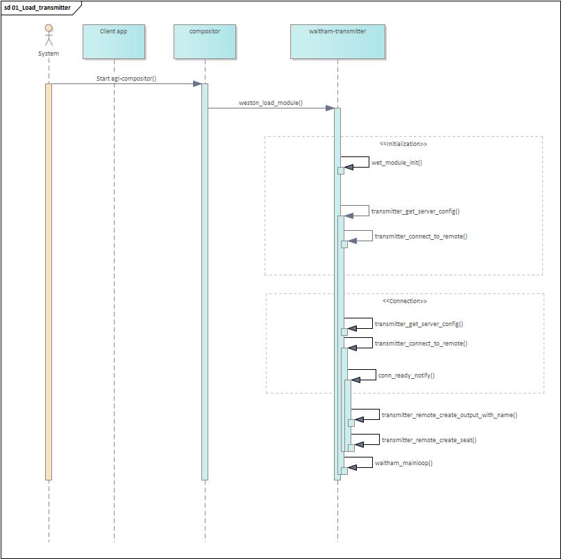
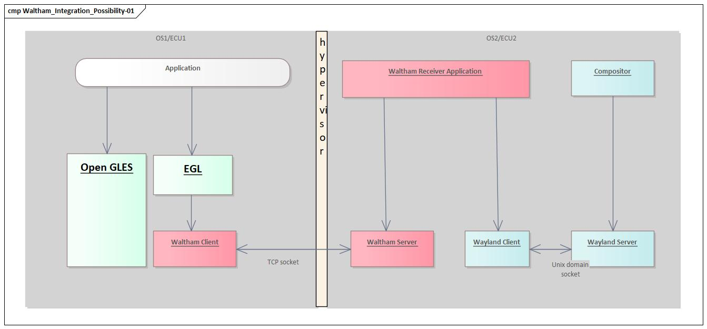

**Table of Content**

1. TOC
{:toc}

## waltham-client-server-applications

### waltham-transmitter-plugin

*waltham-transmitter-plugin* provides an API to create remote connections and
push surfaces over the network and handles remote input.  It is loaded
automatically at start-up, by the compositor. The (remote) outputs are streamed
to the remote side by using the remoting plug-in.

### waltham-receiver

waltham-receiver is a sample implementation of the receiver app which should be
running at the remote side. It is developed based on [waltham
server](https://github.com/waltham/waltham/tree/master/tests), using Waltham
protocol to obtain and process remote input -- handled by
waltham-transmitter-plugin, with the remote output handled by the remoting
plugin.  This component is designed to be used for evaluating the functionality
of waltham-transmitter plugin.

## How it works

### 1. Loading and initialization

As the compositor is starting up, it loads the waltham-transmitter plugin.

### 2. Establishing connection

At `transmitter_create_remote()`, waltham-transmitter creates
`weston_transmitter_remote` object which expresses the receiver object at
remote side, and it is created for each receiver.

*waltham-transmitter* uses `wth_display_get_registry()` and `wth_display_sync()`
for the receiver applications in the same manner as the Wayland protocol
would retrieve the interfaces. Then, the receiver applications sends back
the resource list to the waltham-transmitter.

### 3. Forwarding surface

A fake mechanism of sending the buffer attachments was previously in place. The
following protocol messages to the receiver app were added to notify about
surface updates. 

`wthp_surface_attach()`, `wthp_surface_damage()` and `wthp_surface_commit()`
correspond to `wl_surface_attach()`, `wl_surface_damage()` and
`wl_surface_commit()` message in wayland protocol.

- `wthp_surface_attach()` - Send wthp_buffer as a buffer handling. This is not
the actual buffer which contains the data to be rendered but the handle of an
actual buffer. It abstracts the differences of buffer type.
- `wthp_surface_damage()` - Tell the updated region to receiver app.
- `wthp_surface_commit()` - Tell surface gets updated to receiver app.

These are no longer in place, as the remoting output is being handled entirely
by the remoting plugin.

### 4. Rendering using GStreamer

### 5. Input handling

For handling input events, waltham-transmitter has 2 ways to secure seat.

1. Use `wl_seat` as weston has.
2. Create a new `wl_seat`.

Second case is applicable in case the transmitter side does not have an input
device but the receiver at remote side has one. After `wl_seat` is created,
waltham-transmitter sends input events to the client application when
it gets an input event from the receiver via the Waltham protocol.

The message wthp_send_XXX shows you that input event is forwarded from the
receiver to the transmitter, XXX is filled by the input event name.

### 6. Retry connection

In case the connection gets disconnected during surface sharing,
waltham-transmitter shall re-establish the connection. The `waltham_display`
objects represents the connection between the transmitter and the receiver,
and contains a flag that can be used to detect a disconnect.

That happens in `connection_handle_data()` in case a disconnect is detected.
This flag is checked at every call of `transmitter_surface_gather_state`. When
running is in false state, waltham-transmitter starts to retry the handling
sequence.

It release the waltham protocol objects then it goes to establish a connection
sequence mentioned in 2. Establishing connection.

## Waltham in practice

Here is the example how waltham can be used in hypervisor use case of real
project.

* Weston is used as the wayland compositor.
* waltham-client is implemented for Weston which acts as a Waltham  virtual
  display.
* Application surface is assigned to Waltham virtual display and it's sent to
  the other ECU/OS.  Buffers of surface are transferred via GStreamer(UDP),
  since transferring raw pixel data via Waltham(TCP) is not fast enough.
* Controlling input events (pointer, keyboard, touch) for the surface is
  handled by Waltham.

## How Waltham can be integrated

Some possible integration examples of waltham follow.

### As an EGL backend (theoretical possibility)

Similarly to Wayland back-end for EGL, Waltham client could be a back-end in
the compositor.  For better performance, a generic surface sharing mechanism is
needed in a hypervisor environment.  Applications need to adapt to Waltham.
As waltham is not designed with this use in mind this usage is just a
theoretical possibility.

### As a GStreamer sink (theoretical possibility)

Similarly to Wayland sink, a Waltham sink GStreamer plugin can be implemented
which sends the buffers to a receiver on another domain/OS.  Waltham sink can
utilize frame synchronization and a presentation feedback protocols for video
synchronization.  For better performance, a generic surface sharing mechanism
is needed in a hypervisor environment.  As Waltham is not designed with this
use in mind this usage is just a theoretical possibility.

### As a virtual display in compositor

Virtual display plugin can be implemented in the compositor. This plugin sends
client buffers to waltham-receiver in another domain.  No changes to
applications.  For good performance, a generic surface sharing mechanism is
needed in hypervisor environment.  This is the intended use in mind during
design.

